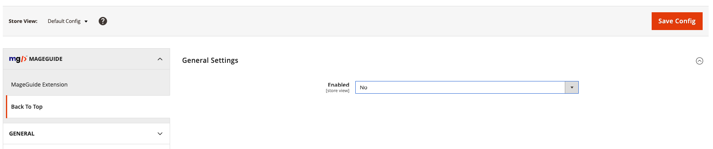
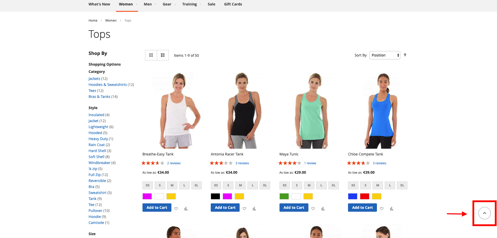

# MageGuide BackToTop
Tested on: ```2.3+```
## Description
Adds a back to top button on every page. When user clicks it, the page scrolls back to the top.

## Functionalities 
- Button works with javascript.
- You can enable or disable the button from Magento Admin.

## Steps to setup
- Upload module files in `app/code/MageGuide`
- Install module
```
        $ php bin/magento module:enable MageGuide_BackToTop
        $ php bin/magento setup:upgrade
```
- To change general module settings go `Stores > Configuration > MageGuide > Back To Top`. 

## Usage
Configuration settings in the admin:

- **Enabled** - Enable/Disable Module

## Screenshots
##### Stores Configuration Settings


##### This is the final result on the frontend

